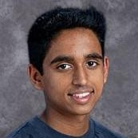

# Shashank's Programming Page



_A potentially older photo of me_

Welcome to my programming page! I am a second year computer science student at UCSD, with an interest in solving algorithms, and deep neural networks for various tasks. I am currently working at the Autonomous Vehicle Laboratory and GURU at UCSD.

Check out my other pages at [Links](#links)


# Favorite Quotes

> "If you use div's you hate blind people" ~ Professor Thomas Powell

# My Least Favorite Line of Code

```
model.eval()
```

Forgetting this single line of code lead to over 25 hours of debugging in a team of 4 for CSE 151B, as it used the train version of a neural network instead of the evaluation version of a network at test time. We don't like model.eval()

# How to make my favorite salsa

## Ingredients
- Tomato
- Onion
- Lime
- Salt
- Garlic
- Cilantro

## Steps
1. Cut baby tomatos into eigths
2. Dice onion finely and mix with tomatos
3. Mince garlic and finely gut cilantro, add to salsa
3. Add lime juice and salt to taste

# My current todo

- [x] Finish CSE 110 homework
- [ ] Start ZyBooks for CSE 140
- [ ] Create autonomous network to do my homework

# Links

[Devpost](https://devpost.com/ShashankVenkatramani)

[Linkedin](https://www.linkedin.com/in/shashank-venkatramani-059016189/)

# Mystery Jumpscare

[Click Here!](cat.jpeg)